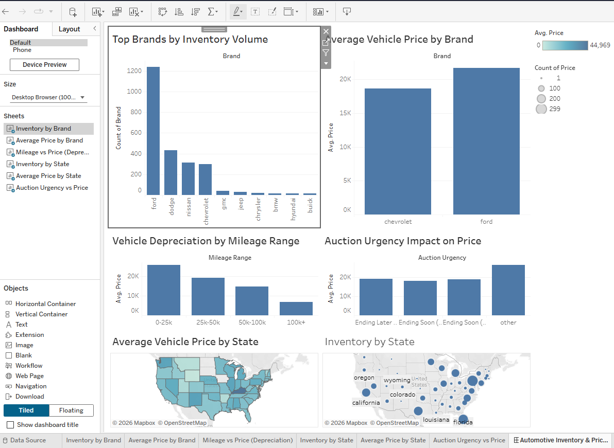

# Automotive Operations & Pricing Analysis

## Objective
Analyze vehicle inventory, pricing trends, depreciation, geographic distribution, and auction urgency to support operational decision making.

## Dataset
USA car auction dataset with 2,499 listings.

## Tools Used
- MySQL
- Python
- Tableau

## Key Questions
- Which brands dominate inventory?
- How does mileage affect pricing?
- Which states have the highest volume and pricing?
- How does auction urgency impact price?

## Key Insights
- Ford dominates inventory with the highest volume
- Lower mileage vehicles command higher prices
- Pennsylvania has the highest inventory count
- Illinois has the highest average prices
- Cars with longer auction time remaining have higher prices

## Business Recommendations
- Focus premium inventory in high-price states
- Optimize pricing based on mileage depreciation
- Leverage auction timing to maximize revenue

- ## Tableau Dashboard

Interactive dashboard link:  
https://public.tableau.com/authoring/AutomotiveOperationsDashboard/AutomotiveInventoryPricingPerformance#2

## Dashboard Preview

